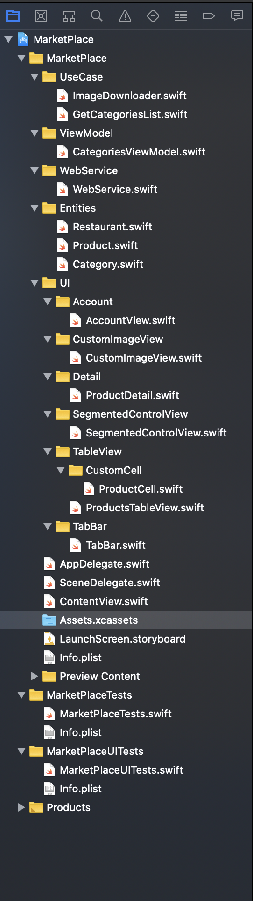

# MarketPlace iOS App
A Simple Markeyplace built using swiftUI

## Description
This App shows is a simple MarketPlace built using MVVM architecture and the power of Combine.

## Architecture

The main idea of the project is to implement Combine along with MVVM architecture with Swift UI.

There are 5 Main Classes:
### ProductsTableView
This class represents the view of the main project, built using Swift UI, This View is subscribing or observing the Data from the View Model.

### CategoriesViewModel
It is the ViewModel that interacts with the model. 

### Category
It represents all the Data abstracted from the business in order to model it and expose to the ViewModel.

### GetCategoriesList
This is a usecase that has a "Published" variable which updates the data from the WebService, everytime there is a service call it is updated and passed to the view which is observing this changes.

### WebService
Calls a restful GET web service to fetch the categories and products displayed.
## Structure

## Screens
### Home

### Product Detail

### Profile

### Complete interaction

## License
©Iván Felipe García Sánchez
